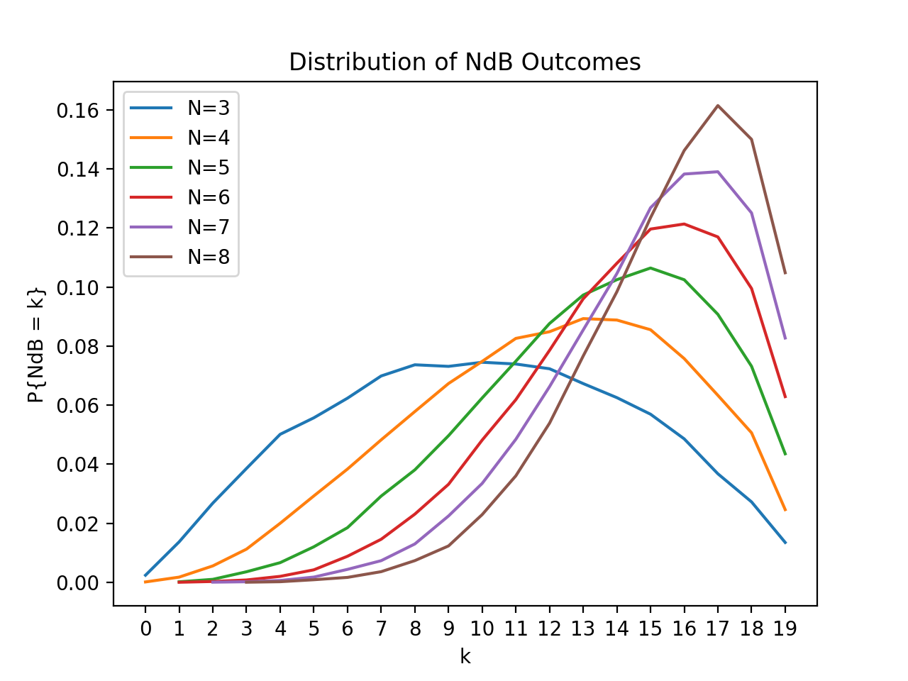
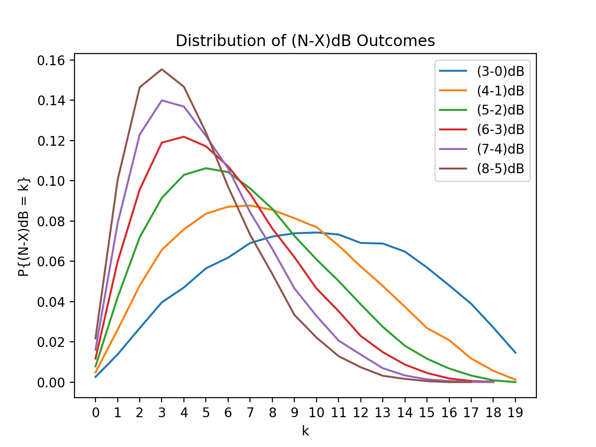
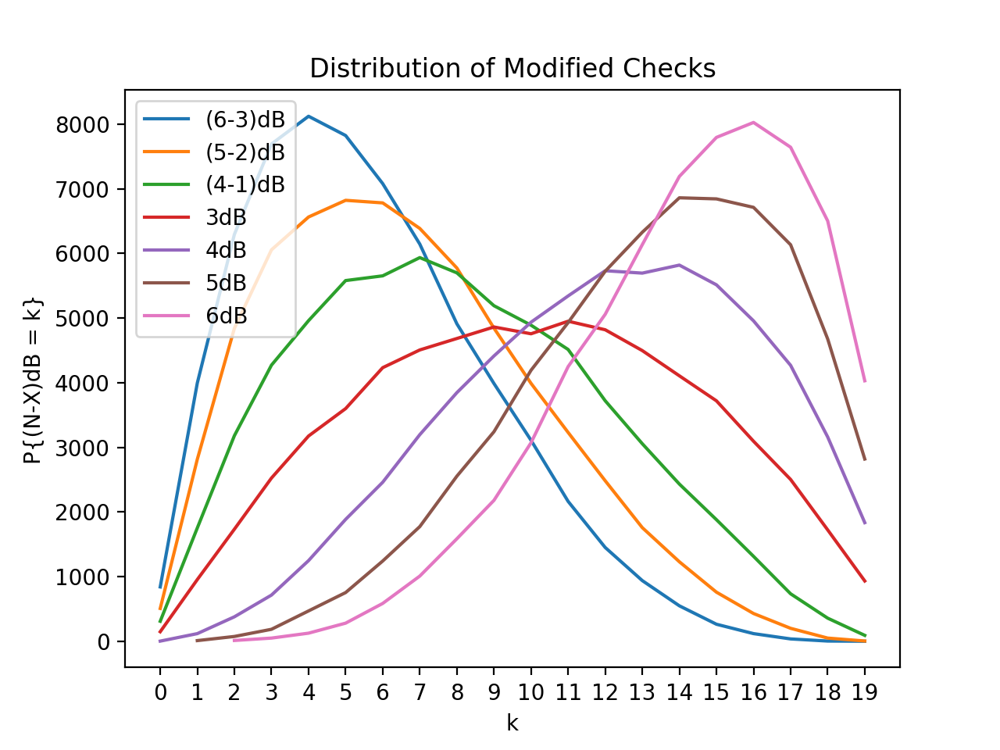

# Decibel
A dice mechanic for tabletop role playing games.

## Simple Checks
To make a simple check, players roll a pool of three or more twenty-sided dice (d20s).
The outcome of the check is the difference between the largest and smallest values.
We will write NdB to denote the outcome of a simple check made with a pool of N dice.

Notice that while the set of possible outcomes (i.e. {0, 1, ..., 19}) is always the same,
the size of the pool determines the distribution of the outcome of a check.
In general, larger dice pools are more likely to produce greater outcomes than smaller
dice pools.

### Example
Suppose that  aplayer is making a simple 5dB check.
The player rolls five twenty-sided dice and gets a result of {6,14,3,7,10}.
The outcome of the check is 14 - 3 = 11.

## Standard Checks
One shortcoming of simple checks is that the distributions of the outcome of all
such checks are skewed in the same direction. Distributions that are skewed in the
other direction can be generated by discarding dice with the greatest values after
rolling. The outcome of the check is the difference between the largest and smallest
of the remaining values. We will write (N-X)dB to denote the outcome of a standard
check made with a pool of N dice and where the X dice with the greatest values are
discarded before computing the outcome of the check.

Notice that a standard (N-X)dB check is not the same as a simple MdB check where
M = N-X. The distributions of the outcomes of these two checks are generally quite
different. 

### Example
Suppose a player is making a standard (7-3)dB check.  The player rolls seven
twenty-sided dice and gets a result of {4, 18, 7, 10, 11, 15, 6}.  The player then
discards the three dice with the greatest values which yields the intermediate result
of {4, 7, 10, 6}.   The outcome of the check is 10-4 = 6.

## Static Resolution
In a _static resolution_ roll, the outcome of a Decibel check is compared to a fixed
target number. This is frequently called a "skill check" in many role playing systems.
If the outcome of the Decibel check is greater than or equal to the target number,
then the check is considered a success.  Otherwise, the check is considered a failure.

## Dynamic Resolution
In a _dynamic resolution_ roll, the outcome of a Decibel check is compared with the
outcome of another Decibel check.  This is frequently called an "opposed roll" in many
role playing systems.  These checks are often used to determine which of two opposing
forces prevails in a direct conflict between the two.  As such, we say that that
whichever check produces the greater outcome wins while the other loses.

If the outcomes of the two checks are equal, then neither check wins (or loses).
In this case, some method of breaking the tie may be required.  Simple options include
re-rolling one or both checks until a winner can be declared, comparing the size of
the dice pools used in the checks, or comparing the results of the dice in the dice
pools that were not used to compute the outcome of the checks.

## Modifiers
A common feature of many role playing systems is _modifiers_.
There are two kinds of modifiers, positive and negative.  A positive modifier increases
the probability that a player succeeds at a static resolution roll or wins a dynamic
resolution roll. A negative modifier decreases the probability that a player succeeds
at a static resolution roll or wins a dynamic resolution roll.
In Decibel, as in many dice pool systems, modifiers change the composition of a dice
pool before a check is made. Positive modifiers can be implemented by simply adding dice
to the dice pool. That is, by increasing the value of N in a standard (N-X)dB check.
Negative modifiers can be implemented by both adding dice to the dice pool and increasing
the number of dice that are discarded before computing the outcome of the check. 
That is, by increasing both the value of N and X by the same amount in a standard
(N-X)dB check.

Notice that, because they both add dice to the dice pool, positive and negative modifiers
do not simply cancel each other out.  In general, as the number of modifiers increases the
variance of the outcome of a check decreases. That said, allowing positive and negative
modifiers to cancel each other out before applying the remaining modifiers leads to simpler
accounting and more manageable dice pools. So, any game system that uses the Decibel dice
system will need to specify how to handle opposing modifiers.

