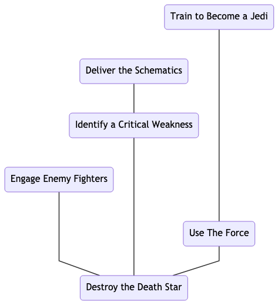

# Narrative Structure
The structure of a traditional tabletop RPG adventure relies on a Game Master (GM) to provide an environment for the other players to explore and interact with.
Frequently, this takes the form of a series of encounters that the players work through one at a time in some predetermined order.
This has the advantage of simplicity and allows the GM to craft a coherent plot but severely limits player agency.  

Alternatively, a GM might prepare a network of possible encounters for the players to explore in a less structured manner.
This give the non-GM players more agency but requires the GM to generate a large amount of content ahead of time, some of which may never be seen by the other players.

We propose a two-stage process that allows the players create the story that they will experience themselves.
In the first stage the players first decide on what the climax of the story will be and work backwards, laying out a series of significant events that lead to the chosen climax until they reach a natural starting point for their story.
In the second stage the players work forwards, filling in the details that surround and connect these significant events until they get back to the climax of their story.

## Encounters
An _encounter_ is a significant event in the game's _storyline_.
Encounters provide the skeleton on which the game's story is built.
Each encounter consists of three components: an _objective_, the _stakes_, and a _difficulty_.
The objective of an encounter is what the characters are trying to accomplish.
The stakes of an encounter is what the characters are risking by attempting to achieve their objective.
The difficulty of an encounter is a mechanical description of how hard it will be for the characters to accomplish their objective.

Encounters are _resolved_ when the players determine the _outcome_ of that encounter.
That is, when the players determine whether the characters accomplish their objective.
If so, then the encounter is said to have been resolved successfully.
Otherwise, the encounter is said to have been resolved unsuccessfully.
The objective should address both the narrative and mechanical rewards that the characters will receive if the encounter is resolved successfully.
The stakes should address both the narrative and mechanical penalties that will be imposed on the characters if the encounter is resolved unsuccessfully.

## Backstories
Once an encounter has been created, other encounters can be added to its _backstory_.
The outcomes of these _backstory encounters_ directly affect the resolution of the original encounter.
Backstory encounters are created like any other and therefore can themselves have backstories.
To limit complexity, each encounter can be a backstory encounter for at one encounter.
As such, this process generates a tree-like structure that culminates with the original encounter.

The relationship between an encounter and its backstory suggests some restrictions on the order in which encounters can be resolved.
To wit, an encounter cannot be resolved until all of its backstory encounters have been resolved and once an encounter has been resolved no additional encounters can be added to its backstory.

#### Example: Star Wars
We imagine how a group of players might, by starting with the climactic encounter `Destroy the Death Star`, use this process to generate (something similar to) the plot of the movie "Star Wars: Episode IV - A New Hope".
This seems like a pretty imposing challenge and they decide that they want a few chances to tip the scales in their favour.
So, they create three encounters that form the immediate backstory for this climax: `Engage Enemy Fighters`, `Identify a Critical Weakness`, and `Use The Force`.

While they agree that `Engage Enemy Fighters` seems interesting enough to delve deeper into on another occasion, they are more interested in exploring what events might have led to the other two encounters.

They create the encounter  `Train to Become a Jedi` as a precursor to `Use the Force`.
They don't have much more to add to the "Jedi" storyline at the moment, but they want to see if it is interesting enough to revisit in subsequent adventures.

Finally, they create the encounter `Deliver the Schematics` as a precursor to `Identify a Critical Weakness`.
Rather than extend this storyline any further back, they decide that it could be more interesting to jump into the middle of the action.

This leaves them several choices of how to proceed in stage two.
They decide to start with the "Jedi" storyline, shift their attention to the "schematics" storyline for the bulk of the game, mix things up with the "fighters" encounter, then return to the "Jedi" storyline.
When they have worked their way through all of these encounters, they hope that they will have set the stage for a suitably dramatic conclusion to their adventure.

## Consequences
An encounter is affected by the _consequences_ of the outcomes its backstory encounters.
The consequences of the outcome of an encounter are derived from its objective and stakes.
By default, success means that the characters accomplish their objective while failure means that the characters lose their stake.

Failure, however, presents the players with the opportunity to choose instead to _raise the stakes_.
This option allows players to mitigate the effects of failure by inserting an encounter into the game's storyline.
This new encounter should be a _sibling_ of the failed encounter.
That is, both the new encounter and the failed encounter should be _children_ of the same _parent_ encounter.
The objective of this new encounter should directly address the consequences of the failed encounter.
The stakes for this new encounter must be greater than those for the failed encounter.

If the players decide to raise the stakes to avoid the consequences of failure then they must abide by the outcome of the new encounter that they create.  That is, they are not allowed to re-raise indefinitely if things do not go their way.

#### Example
We revisit the previous example in which the players used this process to generate the plot of "Star Wars: Episode IV - A New Hope".
Suppose that the characters were unsuccessful in their attempt to `Deliver the Schematics` and that the stakes for that encounter were set to be the capture of one of the characters.
In that case, the players could decide to raise the stakes and insert the new encounter `Rescue the Princess` into the game's storyline.
The objective for this new encounter is to free Princess Leia from the clutches of the tyrannical Galactic Empire.
The stakes for this new encounter are the capture of all of the characters.
This would almost certainly precipitate the premature end of the story. Higher stakes indeed!

