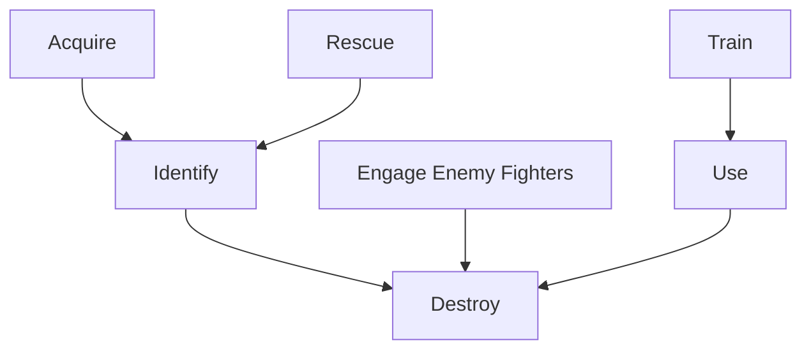

# Game Play
The structure of a traditional tabletop RPG adventure relies on a Game Master (GM) to provide an environment for the other players to explore and interact with.
Frequently, this takes the form of a series of encounters that the players work through one at a time in some predetermined order. This has the advantage of simplicity and allows the GM to craft a coherent plot but severely limits player agency.  

Alternatively, a GM might prepare a network of possible encounters for the players to explore in a less structured manner. This give the non-GM players more agency but requires the GM to generate a large amount of content ahead of time, some of which may never be seen by the other players.

In this example, we propose a very different structure.  

## Encounters
An _encounter_ is a significant event in the game's storyline. The outcome of each encounter hinges on a single _critical resolution roll_.  A critical resolution roll can be a
[static resolution](README.md#static-resolution)
roll or a
[dynamic resolution](README.md#dynamic-resolution)
roll.

To create an encounter, one player should:
   1. Provide a brief narrative description of what the characters will be trying to accomplish during during the encounter.
   2. Establish the parameters of the encounter's critical resolution roll.
      * If the critical resolution roll is a static resolution roll then this amounts to choosing a target number.
      * If the critical resolution roll is a dynamic resolution roll then this amounts to describing the opposition.  This could mean explicitly describing the opposing check or describing the character(s) who will be making the opposing check.

## Backstory
Once the parameters for an encounter's critical resolution roll have been established, all of the players have an opportunity to describe other encounters which comprise the immediate _backstory_ for the original encounter. The outcomes of these backstory encounters will contribute
[modifiers](README.md#modifiers)
to the original encounter's critical resolution roll.
In general, static resolution should be used for backstory encounters should be a if there is a reward for success but no penalty associated with failure.
In this case, success should contribute positive modifiers to the critical resolution roll for the original encounter.
Dynamic resolution should be used if there are penalties associated with failure.
In this case, winning should contribute positive modifiers  to the critical resolution roll for the original encounter while losing should contribute negative modifiers.

This process is recursive.  That is, backstory encounters are
generated in the same way as the original encounter.

## Session
A _session_ is made up of a series of encounters. At the beginning of each session, one of the players describes an encounter that will serve as the _climax_ of the story that the players will tell during that session.

#### Example: Star Wars


```
Destroy the Death Star
|   |-- Use "The Force"
|   |   |-- Train to Become a Jedi
|   |   
|   |-- Identify a Critical Weakness
|   |   |-- Rescue the Princess
|   |   |-- Acquire the Schematics
|   |
|   |-- Shoot Down the Enemy Fighters
```    
