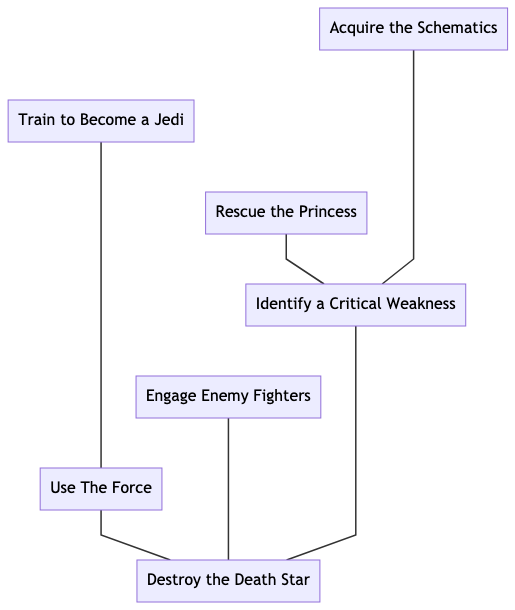
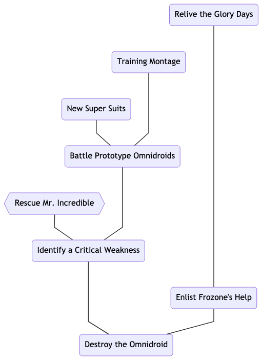

# Narrative Structure
The structure of a traditional tabletop RPG adventure relies on a Game Master (GM) to provide an environment for the other players to explore and interact with. Frequently, this takes the form of a series of encounters that the players work through one at a time in some predetermined order. This has the advantage of simplicity and allows the GM to craft a coherent plot but severely limits player agency.  

Alternatively, a GM might prepare a network of possible encounters for the players to explore in a less structured manner. This give the non-GM players more agency but requires the GM to generate a large amount of content ahead of time, some of which may never be seen by the other players.

In this example, we propose a very different structure.  

## Encounters
An _encounter_ is a significant event in the game's storyline. The outcome of each encounter hinges on a single _critical resolution roll_.  Encounters are created by the players and provide the skeleton on which the game's story is built.

To create an encounter, one player should:
   1. State the _objective_: Describe what the characters will be trying to accomplish.
   2. Set the _stakes_: Describe what the characters stand to lose if they are unsuccessful.
   3. Determine the _difficulty_: Establish the parameters of the critical resolution roll.

A critical resolution roll can be a
[static resolution](README.md#static-resolution)
roll or a
[dynamic resolution](README.md#dynamic-resolution)
roll. If the critical resolution roll is a static resolution roll then establishing that roll's parameters amounts to choosing a target number.
If the critical resolution roll is a dynamic resolution roll then establishing that roll's parameters amounts to describing the opposition.
This could mean explicitly describing the opposing check or describing the character who will be making the opposing check.

## Backstory
Once the parameters for an encounter's critical resolution roll have been established, all of the players have an opportunity to describe other encounters which comprise the immediate _backstory_ for the original encounter.

This process is recursive.  That is, backstory encounters are
generated in the same way as the original encounter.

## Consequences
An encounter is affected by the _consequences_ of the outcomes of the critical resolution rolls for its backstory encounters.
The consequences of the outcome of an encounter are derived from its objective and stakes. By default, success means that the characters accomplish their objective while failure means that the characters lose their stake.

Failure, however, presents the players with the opportunity to choose instead to _raise the stakes_. This option allows players to mitigate the effects of failure by inserting an encounter into the game's storyline.
The objective of this new encounter should directly address the consequences of the failed encounter.
The stakes for this new encounter must be greater than those for the failed encounter.

<!-- The simplest consequences are
[modifiers](README.md#modifiers)
that are applied to the encounter's critical resolution roll;
successes contribute positive modifiers whilst failures contribute negative modifiers. -->

## Adventures
An _adventure_ is made up of a series of encounters. At the beginning of each session, one of the players describes an encounter that will serve as the _climax_ of the adventure.

#### Example: Star Wars



<!-- ```
Destroy the Death Star
|-- Use The Force
|   |-- Train to Become a Jedi
|   
|-- Identify a Critical Weakness
|   |-- Rescue the Princess
|   |-- Acquire the Schematics
|
|-- Engage Enemy Fighters
```     -->

#### Example: The Incredibles



<!-- ```
Destroy the Omnidroid
|-- Identify a Critical Weakness
|   |-- Battle Prototype Omnidroids
|   |   |-- Training Montage
|   |   |-- New Super Suits
|   |   
|   |-- Rescue Mr. Incredible
|   |   |-- A Family Affair
|
|-- Enlist Frozone's Help
|   |-- Relive the Glory Days
``` -->
